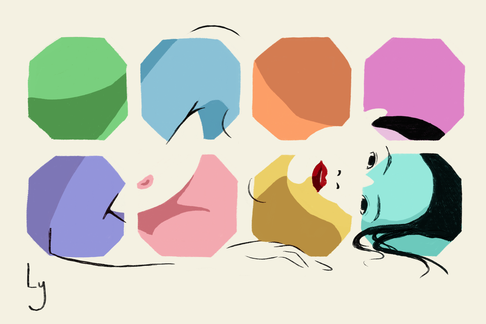
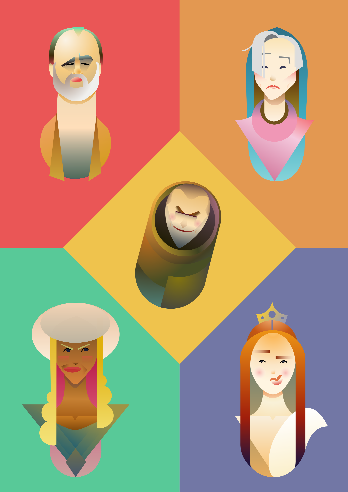
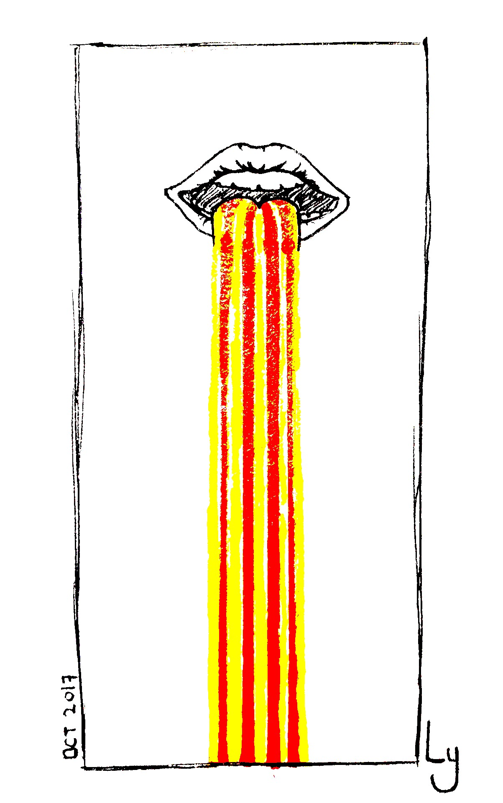
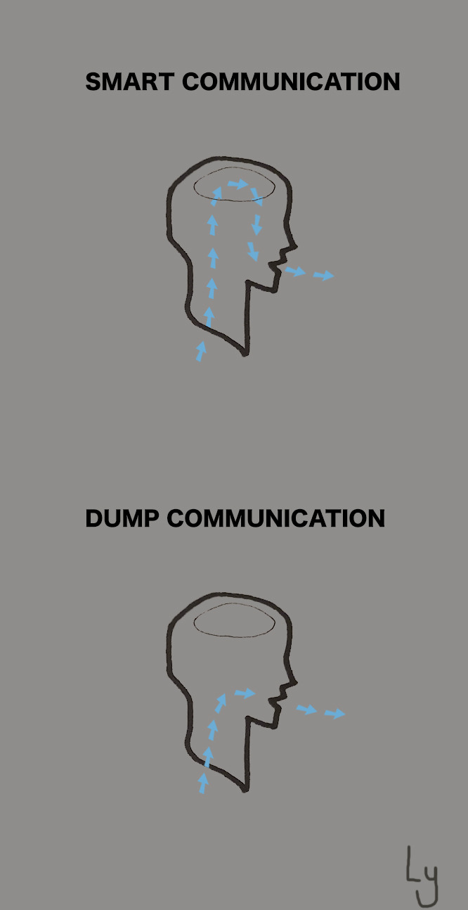

# LY ART 

## 2019

27-7-2019_____________Shibuya Crossing in Tokyo_____________

26-7-2019

16-6-2019_____________Line Art Tokyo Meetup_____________

16-6-2019_____________Line Art Tokyo Meetup_____________

  
   
   

7-6-2019_____________See this drawings in [Vocdoni](https://vocdoni.io/)(awesome decentralised voting platform!) 

21-5-2019

21-5-2019

21-5-2019

16-3-2019

25-3-2019

25-3-2019

12-3-2019_____________My dear friend Fatou from The Gambia_____________

   
10-3-2019_____________Cute 9 year old gambian girl_____________

## 2018

  
   
   
   

20-12-2019_____________To support Venezuela with [Crypto Xmas](https://cryptoxmas.xyz/) project_____________

20-9-2018_____________To support the awesome [Giveth](https://giveth.io/) team_____________

20-9-2018_____________To support the awesome [Giveth](https://giveth.io/) team_____________

20-9-2018_____________To support the awesome [Giveth](https://giveth.io/) team_____________

20-9-2018_____________To support the awesome [Giveth](https://giveth.io/) team_____________

   
29-10-2018
   
29-10-2018
See this drawings in [AglowKids](http://www.aglowkids.com/)  

23-6-2018___________________________3 words Challenge___________________________

2-6-2018___________________________3 words Challenge___________________________

1-6-2018___________________________3 words Challenge___________________________

31-5-2018___________________________3 words Challenge___________________________

 
30-5-2018

30-5-2018 

 
30-5-2018  Watch [this](https://www.youtube.com/watch?v=bmYIgbj8ZMI)!!

29-5-2018

21-3-2018

20-3-2018

8-3-2018

5-3-2018    

## 2017

 
20-12-2017

 
15-12-2017

19-10-2017

23-9-2017

 

20-9-2017

---
  

[Contact 🐨](docs/contact.md) for any questions or feedback 😍 

