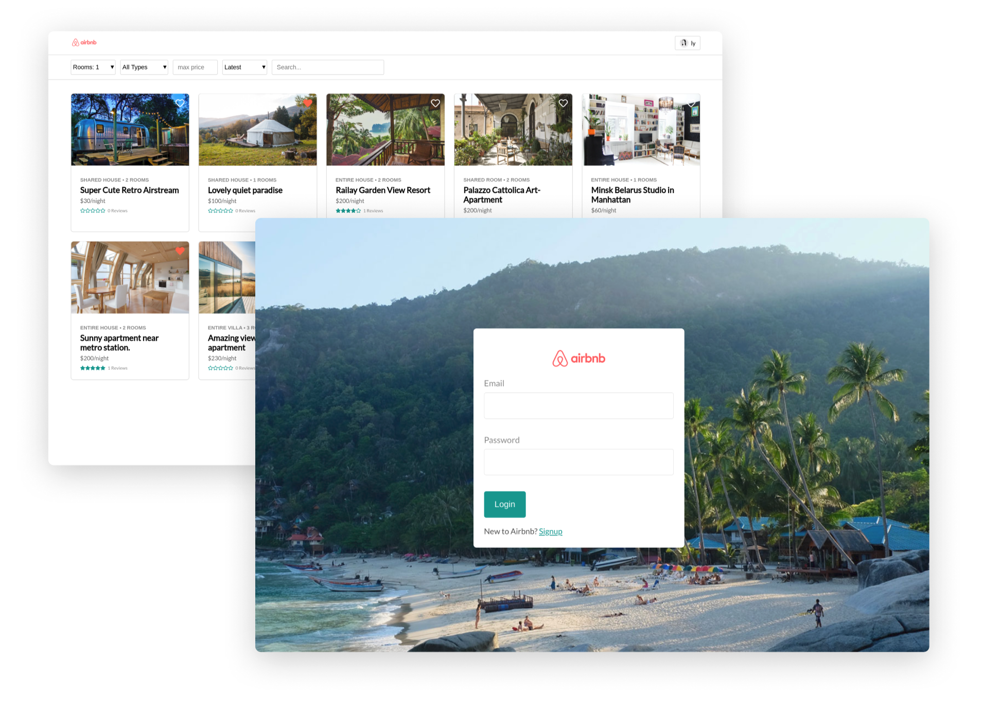

# Airbnb (replica) - React Web Application

_Sep 2019_

Link to the my [Airbnb replica website](https://airbnb-ly.herokuapp.com/) to play around. The code is on github, divided into [front-end](https://github.com/lydialawli/airbnb-react/) and the[ api](https://github.com/lydialawli/airbnb-api).

## Context

I attended a 2 month Fullstack development bootcamp this summer in Thailand.  
In the course, there were constantly new technologies and tools introduced to us. In order to apply all this tools in a real scenario we build the replica of the Airbnb platform. Each of us worked on our own version.

The goal of this project was to learn how to **build from scratch** the **front-end** and the **back-end**, how to connect both ends together, practice and improve our Javascript level, and also to learm how to use external api's and frameworks.

## Stack

- **Javascript** everywhere
- **NodeJS** and **npm**
  
### Frontend

- **React** Framework
- **axios** for requests to the API

### Backend

- **Express JS** to create a server
- **Mongodb** for local database
- **Bcrypt** for ensuring security with encryption
- **Postman** to test the server
- **Jws** to sign and manipulate tokens
- **Cloudify** cloud server for storing image files
- **mLab** cloud database
- **robo3t** a database interface
- **ngrok** to share localhost in different devices to test the app

### Deployment

- **Heroku**

### Business tools

- **Stripe** for managing payments
  