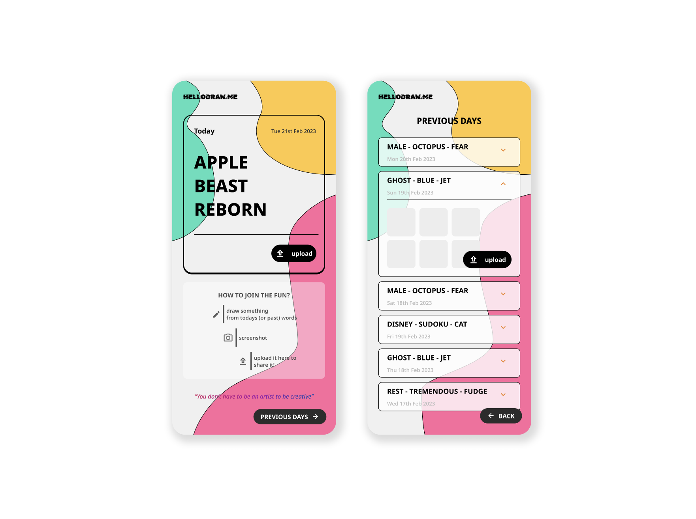

# Draw 3 Words - Art prompting tool (WIP)

_April 2023_

https://draw3words.web.app/ 

## What does this do?

Various artistic prompts to spark creativity.

## Concept context

I had the need for a daily drawing exercise so I decided to build an app to get myself and friends to join the fun To enhance my daily drawing skills and challenge my coding and design abilities, I created an app to engage me and my friends in the fun activity. In the process, I learned how to utilize Firebase tools such as Firestore database CRUD operations, Cloud Storage, and app deployment. Although there are technical aspects to perfect, such as the authentication feature and error resolution, I am excited to continue honing my skills. Please test the app and share your feedback.

## Design process

My objective was to create a dynamic and innovative atmosphere, while still adhering to design principles. I strived for a contemporary and whimsical aesthetic that stretched the limits, yet remained grounded.

I concentrated primarily on the mobile interface, utilizing it as the foundation for the web view.

## Up next

I got feedback from some cool humans and the list is long!
In a nutshell:

- fix image loading delay
- fix inaccessible button
- image carousel?
- upload complete feedback
- web layout ugly
- figure out how to attract the first 4-10 users. Why would they want to use this and keep coming back?
- make it private to avoid spamming (ie users are given an access code)
- think about maybe setting specific days for releasing new words instead of providing every day
    - have a telegram group or newsletter to notify users that next words are coming x date

## Stack

- **NextJS and React** framework
- **Typescript** language
- **TailwindCSS** for UI
- **Firebase/Firestore** for database and hosting

---
  

[Contact 🐨](docs/aboutLy.md) for any questions or feedback 😍 

