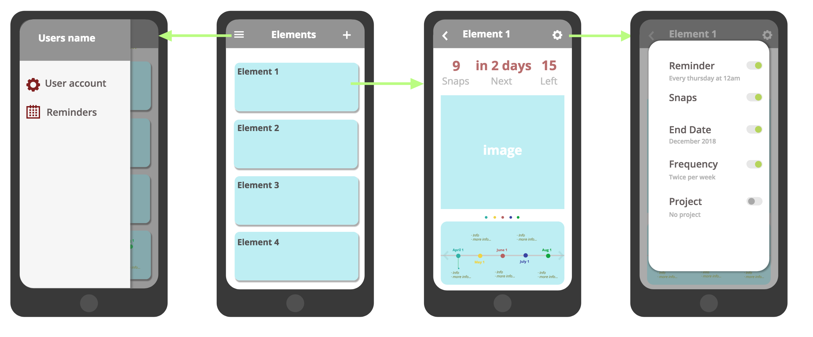

# __EVOK__ - Evolution Tracking tool

_Dec 2018_

Evok is a tool that allows to **record the history** of evolving assets/elements. Assisting to ensure a **coherent input of data** and providing **options to visualise its whole history**.

## Idea

_"The main goal of Evok is to provide __clarity__."_

Evok helps to get __better insights__ and/or __make better decisions__ based on real data.

Change and evolution happen all the time and continuously. Probably in every little possible corner of this planet and universe. Yet, for our human eye, we are unable to detect subtle changes easily ( possibly due to time and space constraints? ).

We are good at distinguishing the differences when are given the picture of __before__ and __after__, not so good for the inbetweens.

With the help of this tool, you are able to accumulate instances of an element, and view its changes in real time, with techniques like *lapsing* (to view an array of images frame by frame, overlapped one after the other in a fast speed, giving the animation effect).

It's not a matter of perceiving change, but to **see** it.

## Context

I was in need of a tool that tracked, saved and showed backs the data of the element I wanted.  
My first use case was to visualise how an avocado plant grew.
For a while I did all the process manually:

- using the phone's defaul camera to take pictures
- for each picture I would pass it to my computer and save it in the same directory as the other pictures.
- I would name each picture to know when I'd taken it.
- I would have to constantly remind myself that it was time to take the next picture
- ...

It was not long before I gave up as it required many steps to be organised and consistent. I had a lot of friction.

## Challenges

Visualising a load of data is the easy part. Graphs, charts, timelines... have been around for quite some time already.

The main difficulty is making sure the data input is consistent and continuous, otherwise the display of the data won't be as accurate and helpful.

Perhaps I'm wrong, but I have the feeling that asking users to **input data continuously and consistently** for the **long term benefit** is just **hard**.

A very thought out and tested UI and incentive system should be in the base of Evok.

## Stack

- __React Native__ framework for the front-end
- __Expo__  
- __Javascipt__

I started building the app with no clue about back-end so the __Expo File System__ worked fine.

## State

There are a set of key features done:

- Camera implementation
- Ability to create and delete directories (elements)
- Storage system (using Expo's File system, not ideal)
- Home page and element page (with all the elements data)
- A very simple timeline and a image that keeps changing as you slide the timeline.
- Onion skin tool in the camera page.
- Gallery page

I am currently testing Flutter to see if it makes sense to change framework as it's all still in early development. Also trying to rethink the arquitecture and roadmap of this app, as I have better knowledge than before.

---

link to the github repo [here](https://github.com/lydialawli/Evok)