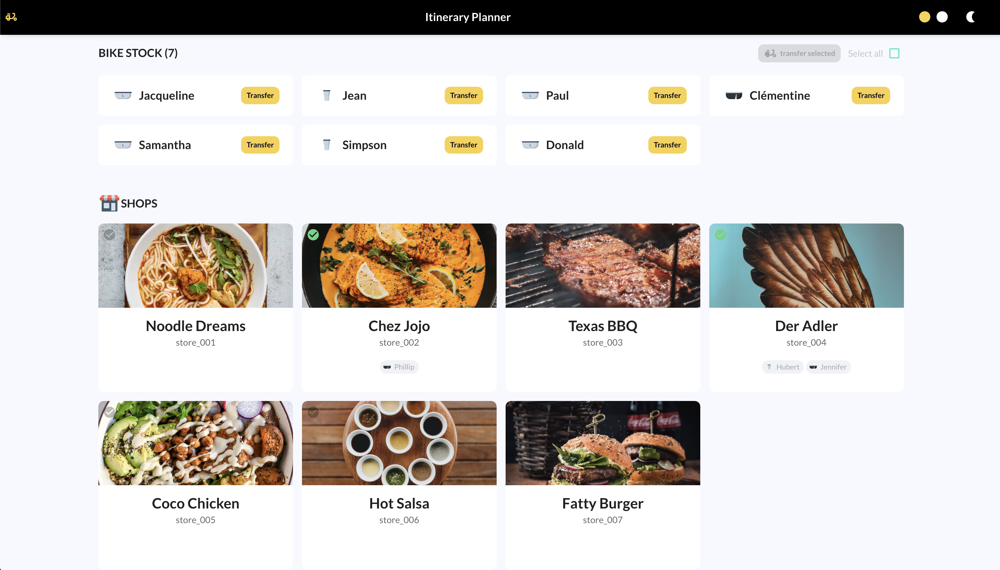
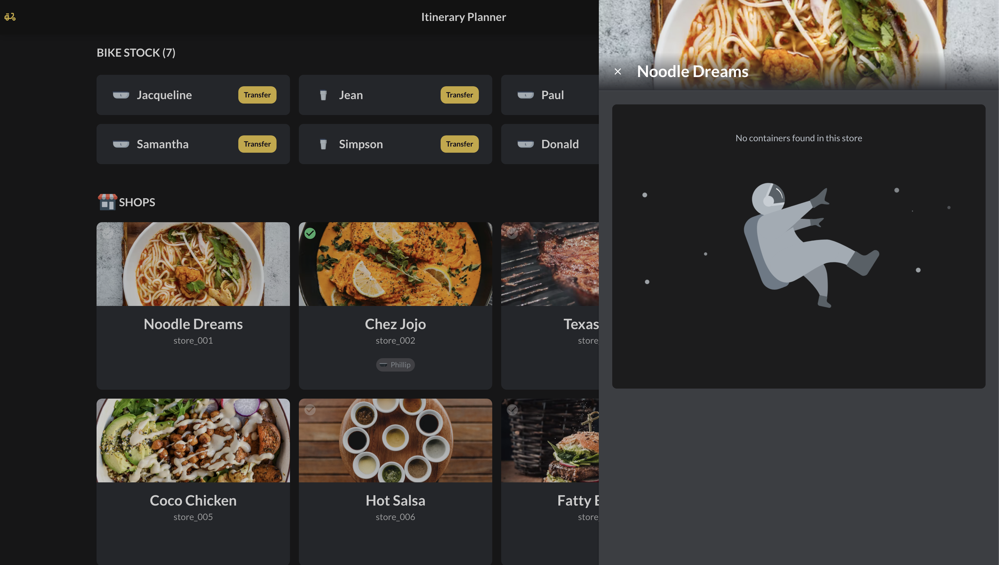
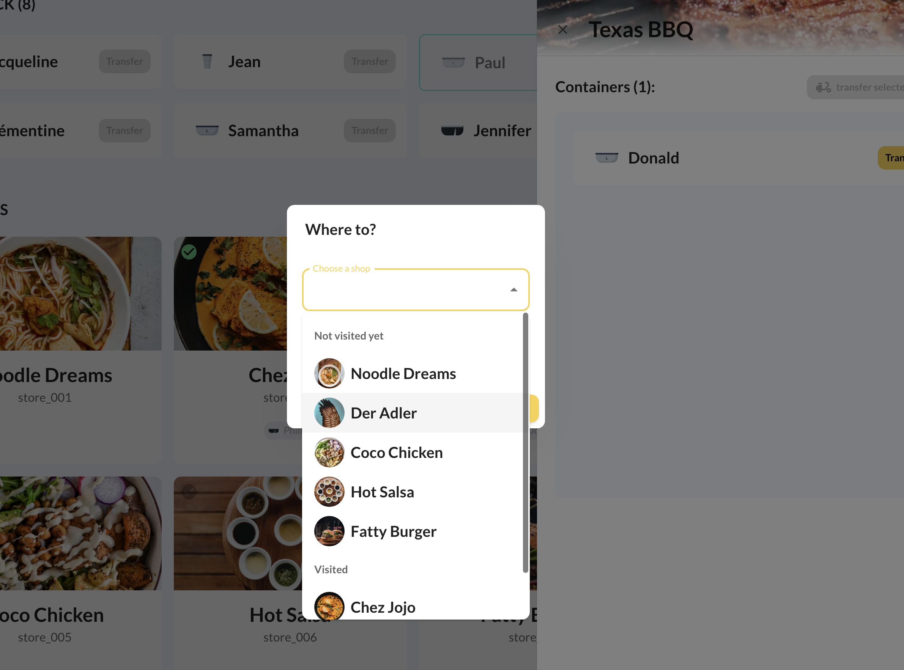

# Itinerary Planner

_Feb 2022_

[Link to the web app](https://lydialawli.github.io/itinerary-planner-ly/)  
[Code on Github](https://github.com/lydialawli/itinerary-planner-ly)

## What does this do?

- Display a list of containers currently in the bike stock
- Display a list of stores, showing:
    - if a store has already been visited
    - the store's containers stock
- feature allow transferring containers between bike stock and store stock
- Select one or multiple containers to transfer

## Context

This was Vytal's entry code challenge for a frontend position.  
The design was not the most relevant but I still had fun making it look pretty and usable.

## Tech stack

- Typescript
- React
- Material-UI
- React Redux

---
  

[Contact 🐨](docs/aboutLy.md) for any questions or feedback 😍 

