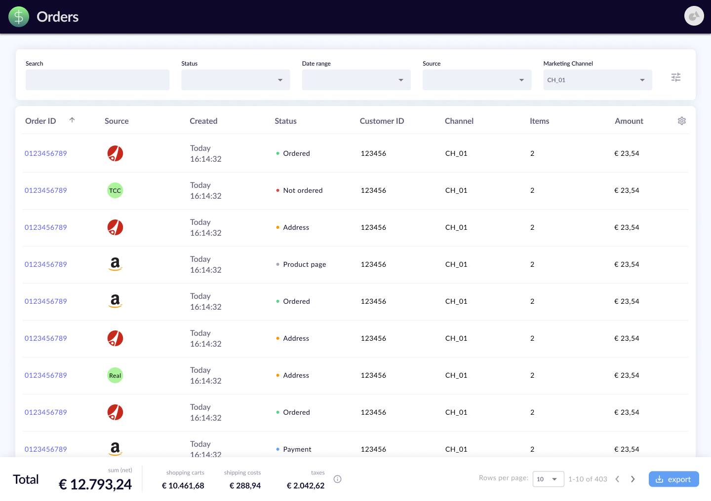
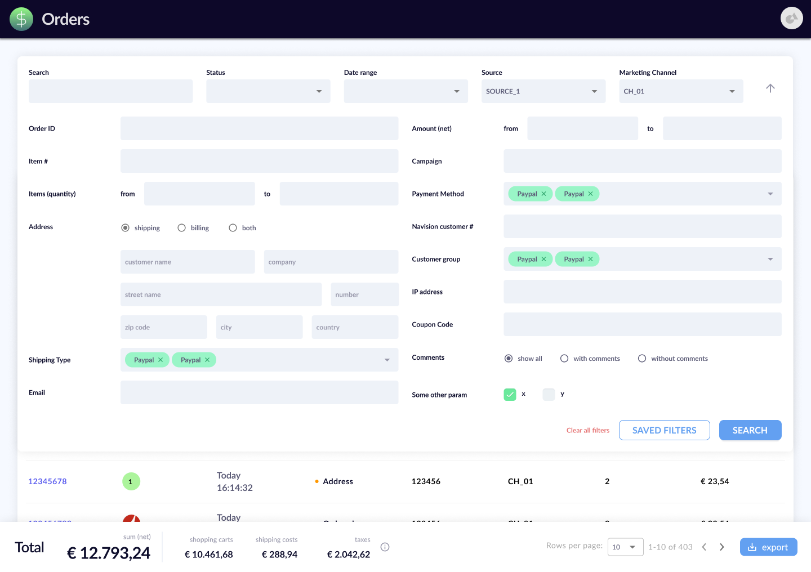
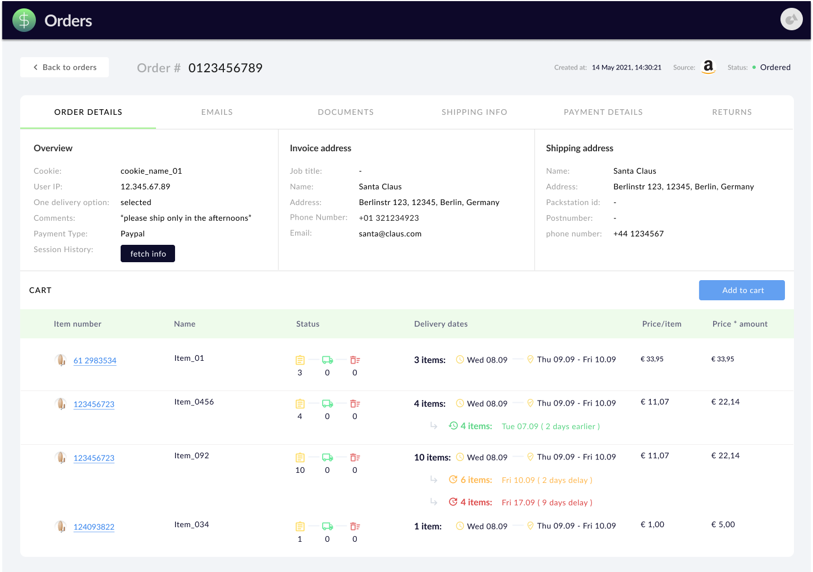

# Orders - web app

_Oct 2021_

## Main/Home Page

## Collapsible filters

## Details Page

## What does this do?

A streamlined platform that provides a comprehensive view of all orders and enables efficient management for an International E-Commerce store.

## Where can I see this live?

As this is an internal tool, it is currently restricted for use only within the organization and is not available for public access.

## Context

As a part of my job, I was given the responsibility of creating and programming a brand new web application with the aim of streamlining the workflow of other departments, particularly Customer Service. Even though most of the necessary features had already been in existence for several years, they were a part of a monolithic application with an outdated design. Therefore, the primary objective was to extract all the ordering features and implement them in a new web app with enhanced functionalities while maintaining the same backend.

While I had been assigned several smaller design tasks; this was the first one where I was fully responsible for the whole design process starting from scratch, which was very exciting and fun.

## Design phase

After several meetings with the business owner to discuss project requirements, I kicked off the design process with preliminary wireframes on paper. As the project progressed, I shifted to Figma, where I performed all remaining design work, prototyping, and refinement. Throughout each stage, I actively involved the developers and business owner to ensure we remained aligned and on track.

To ensure consistency with the development library, Material UI, I referred frequently to relevant documents while building components in Figma. While following Google's design principles, I remained flexible and incorporated creative elements that satisfied project needs.

Thinking ahead, I added components to the design system, which was almost non-existent at the project's start. This served for the following projects like the [Vouchers web app](/docs/projects/vouchers.md).

### Main challenge

Designing the detailed filters and numerous tabs on the Details Page posed a significant challenge due to the copious amount of information that needed to be integrated into the section. While I had the liberty to experiment with various approaches, certain requirements restricted my options. Despite the initial ambiguity, I gradually discerned what was feasible and what was not as I progressed through the project.

## Stack

The designs (such as the screenshots above) are made in **Figma**.

The frontend code was built in:

- React
- MaterialUI
- Typescript
- GraphQL

---
  

[Contact 🐨](docs/aboutLy.md) for any questions or feedback 😍 

