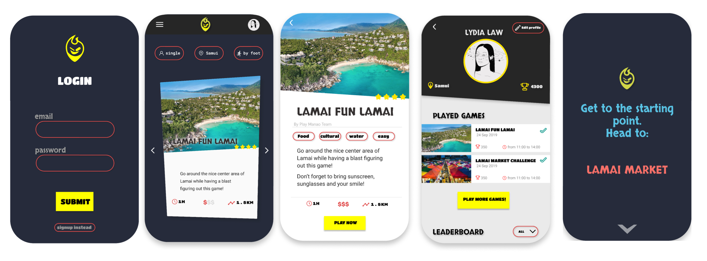
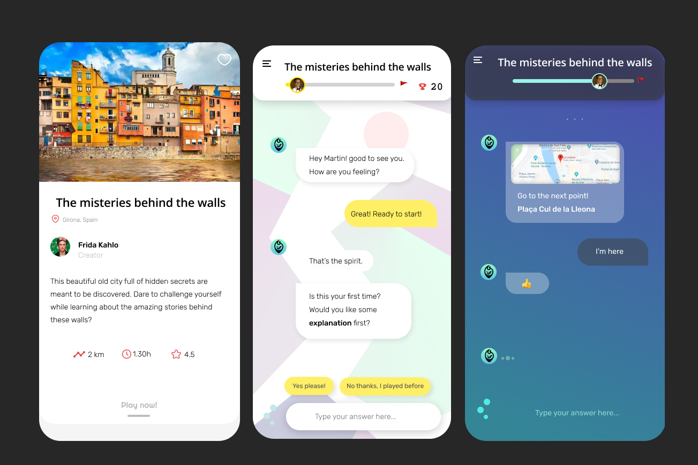
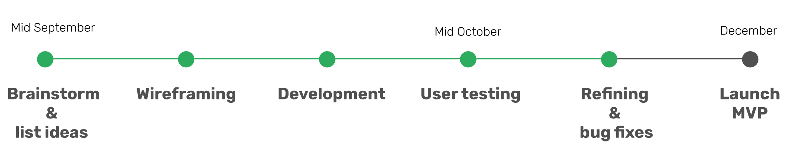

# PLAY MANAO - Geolocated Quizzes app

_Oct 2019_

## What does Play Manao do?

Provides a growing list of **interactive games in the real world** for everyone to join and play.

More detailed explanation [here](/docs/projects/playmanao-doc.md).  
Link to the github repo's here: [frontend](https://github.com/lydialawli/manao-ionic/) and [api](https://github.com/MonicaRiera/manao-api)

## Context

Built by two young developers (me and Monica) as their final project to graduate from a coding bootcamp.

Having 3 weeks to come up with an MVP, Play Manao was developed quite rapidly with two final games ready to be played, both within the island of Samui, Thailand (since the school was located there).

Since we are both based in Catalunya, we will first target users in Barcelona and all this northern area, creatng games based on this locations.

## What does the name mean?

**Manao** means "lime" in Thai and we were inspired by the lime trucks that were advertised daily next to our coding school.
As the first (and ever build) game was based in the island we were in, we decided to embrace that name as it sounded appealing.

## Vision

A **social and global community** where the users themselves enrich the platform by creating games and/or playing and sharing them.  

**Connect enthusiasts and travel lovers** from all over the world through their achievements, shown in a global leaderboard.

Satisfying the human needs for **accomplishment and growth**, by provoking curiosity through challenging problems, building new experiences, and obtaining rewards for their efforts.

Creating a space for **collaborations/teamwork** and challenging rivals through a multiplayer experience.

A positive sum game for both the creators of the games and the local communities, by collaborating with local public services and supporting each other in return.

## Initial Stack

### Frontend

- **Ionic 4 - React** Framework
- **axios** for requests to the API

### Backend

- **Express JS** to create a server using **REST api**
- **Mongo Atlas** cloud database service
- **Bcrypt** for ensuring security with encryption
- **Postman** to test the server
- **Jws** to sign and manipulate tokens
- **mLab** cloud database
- **robo3t** a database interface
- **ngrok** to share localhost in different devices to test the app

### Deployment

- **Heroku**

### Design

- **balsamiq** for wireframing [Play Manao UI](https://balsamiq.cloud/sigbohx/pv2juht)
- **Figma** for prototyping and designing

<!-- ## Road map

--- -->

Link to the github repo [here](https://github.com/lydialawli/manao-ionic/)

---
  

[Contact 🐨](docs/aboutLy.md) for any questions or feedback 😍 

