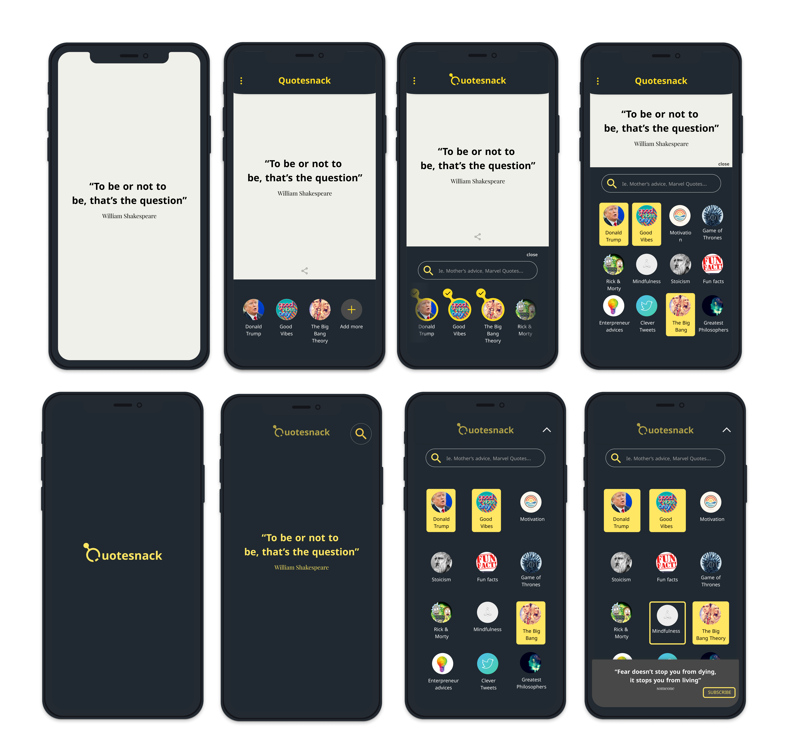

# Quotesnack - mobile app

_April 2020_

## What does Quotesnack do?

Provides you with a quote as frequent as you prefer it. A list of quote packages are available for the user to select and follow.

Quotes appear as push notifications.

## Context

I had not worked on my own stuff for a while and wanted to create something seemingly easy and fun to build, together with my friend.

The goal was to build it fast and have something that we'd be happy to share among our friends.

## Status

For personal reasons, we abandoned the project after the development had started.

## What was Ly in charge of?

- brainstorm and kickstart the project
- the design (logo and the UI) in Figma.

---
  

[Contact 🐨](docs/aboutLy.md) for any questions or feedback 😍 

