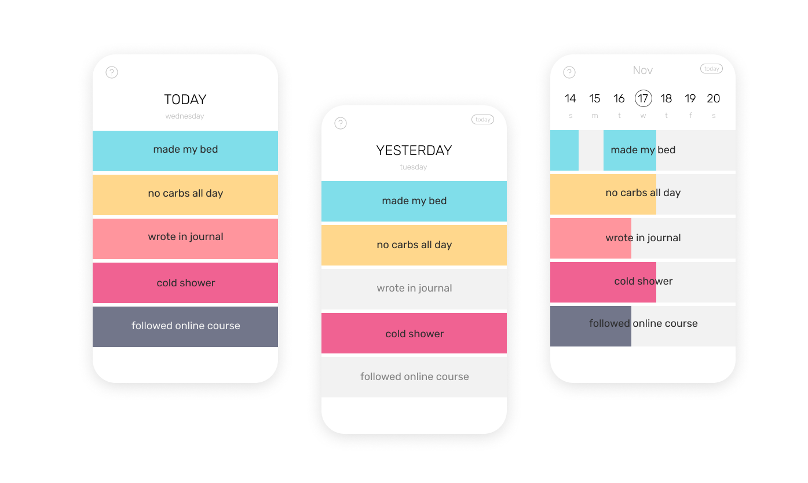

# VAAMOS! - Daily Achievements Flutter app

_Dec 2019_

## What does Vaamos do?

Convenient tool to track goals day by day.
The data is stored as a json file and then converted into Dart for the client side.

The app works without internet and all the data is stored locally in the users device.

## Context

I wanted to test out Flutter framework using Dart language, so I built an app in two weeks.

I learned the logic behind widgets, how to implement existing ones, and how to create my own.

I did not expect to find a struggle decoding and encoding json files with Dart, yet it was a new challenge that I had to overcome. Other than that, the rest of the development was very straight forward.

## Status

App was never officially published but had a working MVP available.

## Stack

- **Flutter** framework
- **Dart** language
- **json**
- **Figma** for prototyping and designing

---
  

[Contact 🐨](docs/aboutLy.md) for any questions or feedback 😍 

