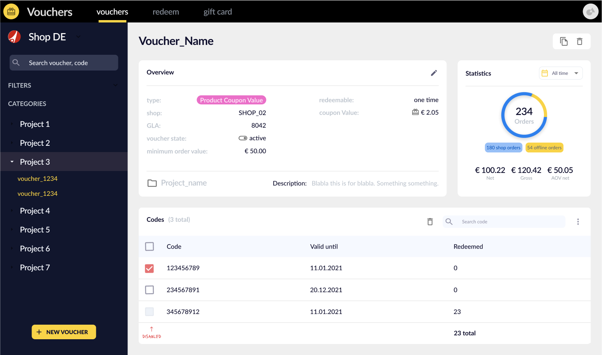
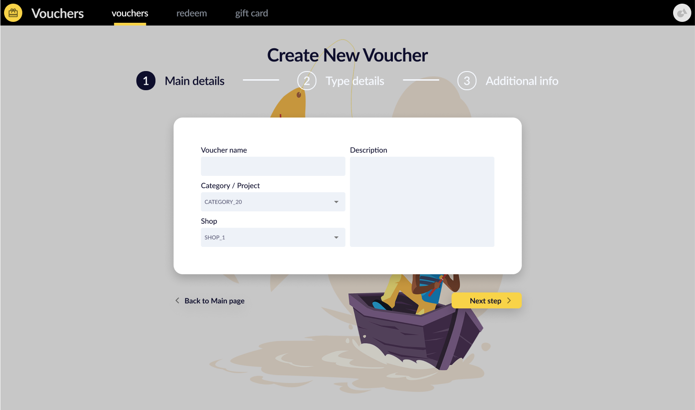
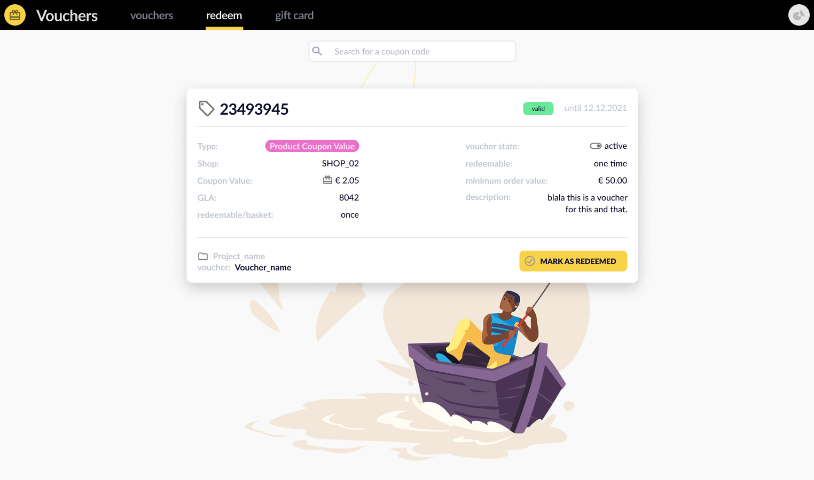

# Vouchers - web app

_Jan 2022_

## What does this do?

One central place to view/create/edit/delete/duplicate vouchers for an International E-Commerce shop.

## Where can I see this live?

This is an in-house/internal tool so unfortunately it is not open to the public.

## Context

I was assigned the task to **design and code** the web app from scratch which would facilitate the job for other departments such as Customer Service.  
Throughout the design sprint; I collaborated closely with the Business Owner to get all the stakeholders requirements fulfilled.

## Stack

The designs (the ones you can see up here) are made in **Figma**.

The frontend code was built in:

- React
- MaterialUI
- Typescript
- GraphQL

---
  

[Contact 🐨](docs/aboutLy.md) for any questions or feedback 😍 

