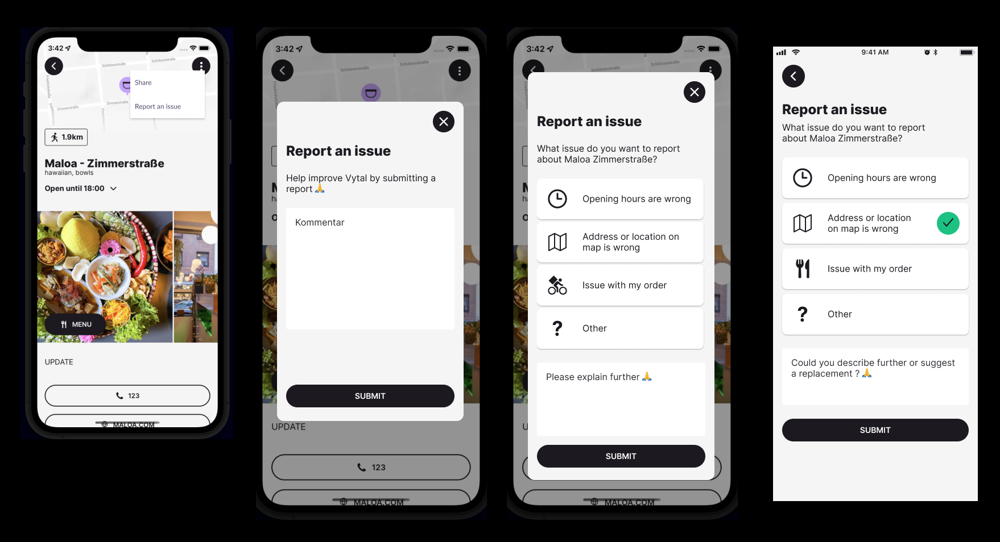

# Vytal App - Report Problem feature

_Nov 2023_

[live on Android](https://play.google.com/store/apps/details?id=com.vytal.vytalconsumerapp&hl=en&gl=US)  
[live on IOS](https://apps.apple.com/us/app/vytal/id1476201142)   
[website](https://en.vytal.org/)

## What does this do?

Introducing a brand-new feature on the Vytal app's primary screens - the ability for users to report any issues they encounter while interacting with a store. This exciting addition streamlines the process of addressing store-related issues, making it faster and easier than ever before.

## Design process

From a stylistic standpoint, the design system was already in place so I was able to jump straight into the UX portion of the project without any prior adjustments needed. This proved to be extremely helpful as it gave me the opportunity to focus solely on understanding the requirements, identifying the possible report types, and designing an intuitive process that would be simple for the user.

Throughout the process, I was faced with decisions such as "should I employ a modal or use an entire screen?" and I had to carefully consider which was most appropriate for this particular feature.

Despite the task being relatively small in scale, it was still a stimulating challenge and I relished the chance to work collaboratively with my colleagues in order to shape the feature to the best of our ability.

## Ly at Vytal

_From May to late Dec 2023_

I joined the team as a **react native developer**. This was my last task and I had the chance to also take part on the **design**.  
I had the freedom to play around with different UI/UX, so long I respected the design system in place.  

## Stack

The design was done in **Figma** and the code is written in **Typescript on React Native**.

---
  

[Contact 🐨](docs/aboutLy.md) for any questions or feedback 😍 

