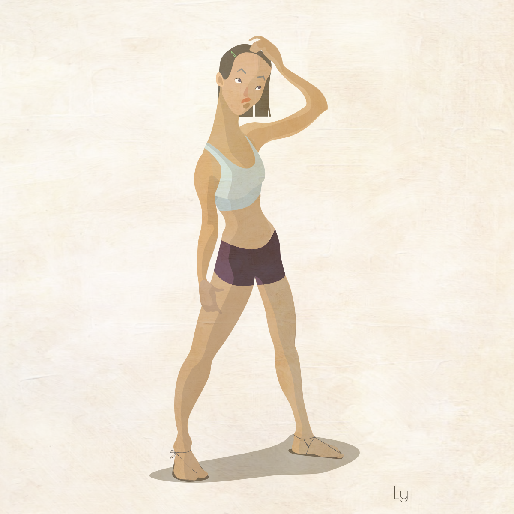
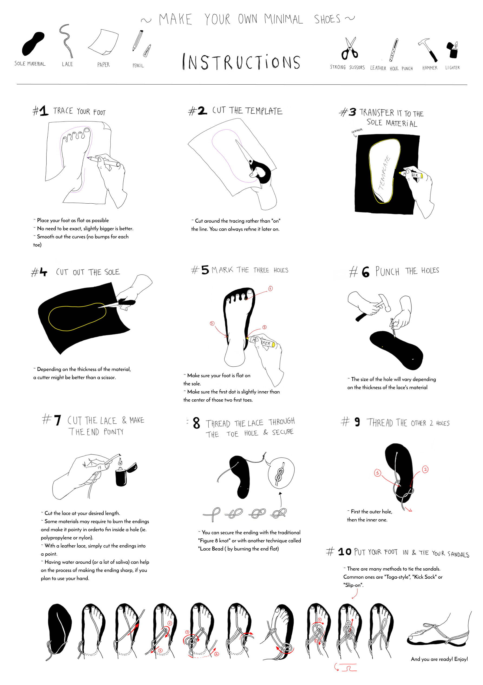
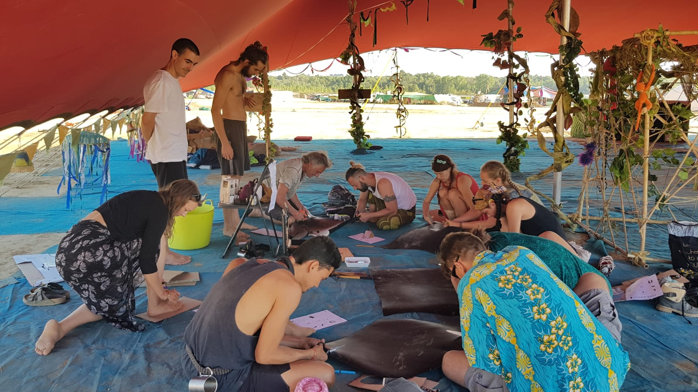

# Using minimalist footwear

_"Closest way to barefoot walking"_ 

August 2019

---

## Introduction

Around 2016, Ly was first introduced to the idea of running and walking with "minimal shoes", or even barefoot.  
The idea of it sounded cool but it wasn't internalised in her enough to switch from "normal" shoes to those primitive-funny-looking soles.😝

She then read [_Born to Run_](https://en.wikipedia.org/wiki/Born_to_Run:_A_Hidden_Tribe,_Superathletes,_and_the_Greatest_Race_the_World_Has_Never_Seen), by Christofer McDougall, and got super motivated to give it a try. Since then, it has become her preference pair of shoes for her daily life (for walking and also trail running).

---

## Which ones to get?

There are many brands nowadays that aim to replicate barefoot walking with their designs and materials. One successful brand is the [Vibram Five Fingers](https://eu.vibram.com/en/shop/fivefingers/). 

Ly got herself one of those in 2017 and she is pretty happy about them. 
**Lasts long** (but of course it's relative to how much you use it), **protects** you from tough conditions and it allows you to **maintain the barefoot walking mechanism**. 
In general, Ly prefers her hand-made sandals as it **feels like you’re not wearing anything** even though you have strong layer of protection.

(The points below are mainly to describe Ly's experience wearing hand-made shoes, but can be applicable to vibrams too)

### Benefits

- can run longer distances without hurting the knee
- body goes back to walking "naturally" and "properly"
- doesn't constrict your feet
- feet gets eventually stronger and confortable with different terrains
- more body awareness
- affordable
- fast to wear
- Let's your feet breathe so it doesn't get stinky 
- storing them is easy as they occupy close to nothing

### Challenges

- must be extra careful with the steps
- may get damaged or in need of fixes every now and then
- cannot run as fast and "jumpy" as when using classic sport shoes
- does not protect you from the cold, so extra (five finger) socks can help a lot
- in rainy days, it can be extra challenging to walk on them, though it dries fast
- might get a lot of stares (which well, so what 🤷🏻‍♀️)

---

## Making your own minimal shoes

### Preparation

There are so many cool tutorials out there that shows how to DIY your own shoes with very basic materials.  
Ly's partner discovered this version (image) below which consists of a good piece of leather and a decent lace. Nothing you can't get easily. 

### Setup

Once acquired all the necessary tools and material, the **average time** to set this up (from scratch) is approximately **20-30 minutes**.    
Logically, the more you practice, the faster it gets.

The image below is Ly's attempt to simplify the **steps in a visual way**.  
There are quite a lot of video tutorials out there too. So many options and styles. Gotta test them out to know what fits you best.  
Check out [Xero Shoes](https://xeroshoes.com/sandals/), they're like the bible for minimalist footwear 🙇🏻‍♀️

### Maintenance

The part that tends to break faster is the **lace** from the bottom part of the big toe, as it’s facing the ground.  
When it breaks, simply untie the knots and pull the string further to the toe and redo the 8 knot.
No need to remove the lace from the three holes.

<a href="../src/huaraches-instructions.png" download="../src/huaraches-instructions.png">Download here</a>

---

### Nowhere 2019 workshop

Here is a picture of the recent workshop hosted in the beautiful Nowhere fest.

---
  

[Contact 🐨](docs/aboutLy.md) for any questions or feedback 😍

